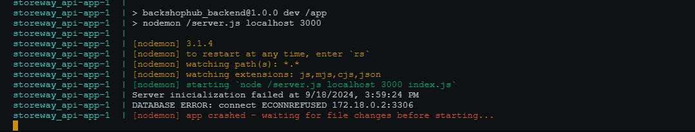

## Configurando o Projeto StoreWay com Docker Compose

### 1. Pré-requisitos

Antes de começar, você precisará ter o Node.js, Docker e o Docker Compose instalados em sua máquina. Caso ainda não tenha essas ferramentas, você pode instalá-las através dos seguintes links:

- [Node.js](https://nodejs.org/pt)
- [Docker](https://www.docker.com/get-started)
- [Docker Compose](https://docs.docker.com/compose/install/)
### 2. Criar uma conta no Mailtrap

A StoreWay APi utiliza o serviço Mailtrap para testar o envio de e-mails. Siga as etapas abaixo para criar uma conta no Mailtrap:

- Acesse [Mailtrap](https://mailtrap.io/).
- Crie uma conta gratuitamente.
- Após o login, crie uma nova inbox.

Anote as seguintes informações do seu inbox no Mailtrap:

- `MAIL_HOST`: Endereço do servidor SMTP.
- `MAIL_PORT`: Porta do servidor SMTP.
- `MAIL_USER`: Nome de usuário para autenticação no servidor SMTP.
- `MAIL_PASS`: Senha para autenticação no servidor SMTP.

Lembre-se de atualizar as configurações do .env com as informações do seu inbox Mailtrap.

### 3. Criar uma conta na Backblaze

A StoreWay API utiliza o serviço Backblaze para armazenar imagens dos usuários e de produtos. Siga as etapas abaixo para criar uma conta na Backblaze:

- Acesse o site da [Backblaze](https://www.backblaze.com/).
- Clique em "Get Started" para criar uma nova conta.
- Na opção  `B2 Cloud Storage` clique em `Try for Free`.
- Preencha as informações necessárias e siga as instruções para verificar sua conta.
- Faça login na sua conta da Backblaze.
- No painel, vá para "Buckets" e clique em "Create a Bucket".
- Siga as instruções para configurar seu novo bucket.

Anote as seguintes informações do seu Bucket:

- `BUCKET_ID`: Id do bucket.
- `BUCKET_NAME`: Nome do Bucket.
- `APP_KEY`: Chave de aplicação.
- `KEY_ID`: Id da chave de aplicação.

Lembre-se de atualizar as configurações do .env com as informações do seu Bucket.
### 4. Estrutura do Projeto

O projeto **StoreWay** já possui dois arquivos essenciais para configurar o ambiente com o Docker:

- **Dockerfile**: Define a imagem da aplicação Node.js.
- **docker-compose.yml**: Arquivo que define como os serviços (aplicação e banco de dados MySQL) serão orquestrados.
### 5. Configuração do Dockerfile

O arquivo `Dockerfile` é responsável por configurar a imagem Docker da aplicação. Ele contém:

```dockerfile
FROM node:14
WORKDIR /app
COPY package.json package-lock.json ./
RUN npm install
RUN npm install -g nodemon
COPY . .
EXPOSE 3000
CMD ["npm", "run", "dev"]
```

Esse Dockerfile faz o seguinte:

- Usa a imagem base do Node.js.
- Define o diretório de trabalho da aplicação com `/app`.
- Copia os arquivos `package.json` e `package-lock.json` e executa a instalação das dependências.
- Instala dependências para o backend dentro do containêr da aplicação.
- Instala globalmente o `nodemon` para reiniciar o servidor automaticamente quando há alterações no código.
- Copia o restante dos arquivos para o contêiner e expõe a porta `3000`.
- Executa o comando  `npm run dev` ao iniciar o contêiner.

### 6. Configuração do Docker Compose

O arquivo `docker-compose.yml` define dois serviços: a aplicação Node.js e o banco de dados MySQL. Ele se encontra configurado da seguinte forma:

```yml
version: '3'
services:
  app:
    image: storeway
    build:
      context: .
      dockerfile: Dockerfile
    ports:
      - "${SERVER_PORT}:3000"
    volumes:
      - ./:/app/
    environment:
      - NODE_ENV=development
    depends_on:
      - db
  db:
    image: mysql:5.7
    environment:
      - MYSQL_ROOT_PASSWORD=${DATABASE_PASSWORD}
      - MYSQL_DATABASE=${DATABASE_NAME}
    volumes:
      - db-data:/var/lib/mysql
    ports:
      - "3306:3306"
volumes:
  db-data:
```

1. **O que o arquivo faz:**

- **Define dois serviços:**
	1.  **app:**  A aplicação Node.js que é criada com base no `Dockerfile`. Ela será executada na porta configurada pela variável de ambiente `${SERVER_PORT}` e mapeada para a porta `3000` dentro do contêiner.

	2. **db:** O serviço de banco de dados MySQL, que usa a imagem `mysql:5.7` e as variáveis de ambiente para configurar o banco de dados e a senha.
-  **Volumes:** Um volume nomeado como "`db-data`" é usado para persistir os dados do MySQL, mesmo que o contêiner seja removido.
- **Depends_on:** O serviço `app` só será iniciado após o serviço `db` estar rodando.

### 7 Variáveis de Ambiente

No arquivo `docker-compose.yml`, as seguintes variáveis de ambiente são utilizadas:

- `${SERVER_PORT}`: Define a porta em que o servidor da aplicação será exposto.
- `${DATABASE_PASSWORD}`: Define a senha do banco de dados MySQL.
- `${DATABASE_NAME}`: Define o nome do banco de dados.

Em seu arquivo `.env` na raiz do projeto você irá precisar dessas variáveis de ambiente abaixo, não esqueça de anota-las:

```.env
# .env
SERVER_PORT=3000
DATABASE_PASSWORD=sua_senha
DATABASE_NAME=storeway
```

Lembre-se de atualizar as configurações do .env com as informações do seu Bucket.

### 8. Configurando o Arquivo `.env`

Crie um arquivo `.env` na raiz do projeto para definir as variáveis de ambiente utilizadas pelo `docker-compose.yml`. Estas variáveis são necessárias para configurar tanto o servidor da aplicação quanto o banco de dados MySQL.

```.env
# Porta em que o servidor da aplicação será executado
SERVER_PORT=3000

# Configurações do Banco de Dados MySQL
DATABASE_HOST=db
DATABASE_USER=root
DATABASE_PASSWORD=sua_senha
DATABASE_NAME=storeway

# Configurações do Mailtrap (para testes de e-mail)
MAIL_HOST=smtp.mailtrap.io
MAIL_PORT=2525
MAIL_USER=seu_usuario
MAIL_PASS=sua_senha
MAIL_FROM=seu_email@mailtrap.io

# Senha para assinar e verificar tokens JWT
SECRET_KEY=escolha uma senha forte e cole aqui

# Configurações da Backblaze (para armazenamento de arquivos em nuvem)
BUCKET_ID=seu_bucket_id
BUCKET_NAME=seu_bucket_name
APP_KEY=sua_chave_de_aplicacao
KEY_ID=seu_key_id

```

Preenchendo as variáveis:

- **SERVER_PORT**: Define a porta na qual o servidor da aplicação será exposto. Neste exemplo, estamos utilizando a porta `3000`, mas você pode alterá-la conforme necessário.
- **DATABASE_HOST**: O host do banco de dados é configurado como `db`, que corresponde ao nome do serviço MySQL no arquivo `docker-compose.yml`.
- **DATABASE_USER** e **DATABASE_PASSWORD**: O nome de usuário e a senha do banco de dados MySQL. No exemplo, usamos `root` como usuário, e a senha deve ser configurada conforme sua preferência.
- **DATABASE_NAME**: Nome do banco de dados que será criado. Aqui, usamos `storeway`, mas você pode escolher outro nome se preferir.
- **MAIL_HOST, MAIL_PORT, MAIL_USER, MAIL_PASS, MAIL_FROM**: Informações de conexão do Mailtrap. Preencha com as informações da sua inbox criada no Mailtrap.
- **SECRET_KEY**: Chave usada para assinar e verificar tokens JWT. Certifique-se de escolher uma chave forte.
- **BUCKET_ID, BUCKET_NAME, APP_KEY, KEY_ID**: Informações necessárias para a integração com o serviço Backblaze, responsável pelo armazenamento de imagens dos usuários.

### 9. Iniciando o Projeto com Docker Compose

Agora que você tem o `Dockerfile`, `docker-compose.yml` e o arquivo `.env` configurados, basta seguir os seguintes passos para rodar o projeto:

1. **Build e Inicialização dos Contêineres**:

	Execute o comando abaixo para construir as imagens e iniciar os contêineres:
  
	```bash
	npm i && docker-compose up -d && docker-compose logs -f app
	```

Esse comando vai:

- Instalar todas as dependências utilizando o npm, que são necessárias para iniciar o projeto.
- Construir a imagem da aplicação a partir do `Dockerfile`.
- Baixar a imagem do MySQL.
- Inicializar os contêineres da aplicação e do Banco de dados em modo (detached mode) para não ficar um amontoado de logs poluindo o seu terminal.
- Iniciar apenas os logs da aplicação para que você possa visualizar apenas o estado do servidor.

Você pode ajustar o comando conforme necessário.

### 10. Executando o Script SQL para Criar as Tabelas

Para configurar o banco de dados com as tabelas necessárias, você deve executar o script SQL que se encontra no arquivo `script.sql` localizado na pasta `database` do projeto. Você pode fazer isso conectando-se ao contêiner MySQL e executando o script:

- **Acesse o contêiner do banco de dados:**
	```bash
	docker-compose exec db bash
	```

- **Acesse o MySQL dentro do contêiner:**
	```bash
	mysql -u root -p
	```
Quando solicitado, insira a senha do banco de dados definida na variável `DATABASE_PASSWORD`.

- **Execute o script SQL:**
	```bash
	source /app/src/database/script.sql;
	```
Isso irá criar as tabelas e estruturas necessárias no banco de dados.

### 11. Conectando ao Banco de Dados com um Gerenciador

Para se conectar ao banco de dados MySQL que está rodando no contêiner usando um gerenciador como o MySQL Workbench, siga estas etapas:

1. **Abra o MySQL Workbench (ou outro gerenciador de banco de dados).**
2. **Crie uma nova conexão:**
    - **Hostname:** `127.0.0.1` (ou `localhost`)
    - **Porta:** `3306`
    - **Username:** `root`
    - **Password:** Utilize a senha definida na variável `DATABASE_PASSWORD` do seu arquivo `.env`
3. **Clique em "Testar Conexão" para verificar se a configuração está correta.**
4. **Se a conexão for bem-sucedida, clique em "OK" para salvar a conexão e começar a gerenciar o banco de dados.**
### 12. Gerenciando Contêineres

Aqui estão alguns comandos úteis para gerenciar os contêineres:

- **Iniciar os Contêineres**:
	Para Iniciar todos os contêineres
	```bash
	docker-compose start
	```

- **Parar os Contêineres**:
	Para parar todos os contêineres sem removê-los (para reiniciar mais tarde), execute:
	```bash
	docker-compose stop
	```

- **Reiniciar os Contêineres**:
	Para reiniciar os contêineres, você pode parar e iniciar novamente com:
	```bash
	docker-compose restart
	```

- **Remover Contêineres e Rede Associada**:
	Para parar e remover os contêineres e a rede associada, execute:
```bash
docker-compose down
```

### 13. Persistência de Dados

O volume `db-data` garante que os dados do banco de dados MySQL sejam persistidos, mesmo que os contêineres sejam removidos. Isso significa que, ao reiniciar o Docker Compose, o estado do banco de dados será mantido.

### 14. Demonstração de inicialização do servidor


Observe que após rodar o comando `npm i && docker-compose up -d && docker-compose logs -f app` o servidor retorna a seguinte saída:



Isso acontece porque as vezes o Docker Compose não consegue iniciar o container do banco de dados antes de inciar o container da aplicação, mas basta esperar alguns segundos que o Docker Compose irá realizar o trabalho dele configurando tudo pra você se você configurou tudo corretamente o(￣▽￣)ｄ.

## Sumário

- [Visão Geral](../../README.md)
- [Introdução](../introduction.md)
- [Guia de Configurações do Ambiente sem Docker Compose](../enviromentConfig/defaultEnvironmentConfiguration.md) 
- [Guia de Configurações do Ambiente com Docker Compose](../enviromentConfig/configWithDockerCompose.md)
- [Endpoints](../Endpoints.md)
- [Autenticação do Usuário](../authentication.md)
- [Contribuição](../contribution.md)
